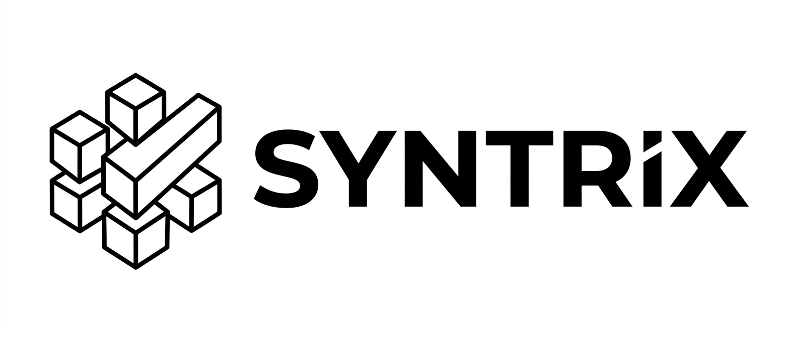

# Syntrix


<p align="center">
  
</p>


**Privacy-aware AI infrastructure for reliable structured data workflows.**

Syntrix is a production-oriented AI system that combines **LLM-based reasoning** with **deterministic validation layers** to generate, validate, and control structured synthetic data.

The first application of Syntrix focuses on **synthetic tabular data generation** for testing, prototyping, evaluation, and privacy-sensitive AI workflows without relying on real personal or business data.

---

## Why Syntrix?

LLMs are powerful for understanding semantics, domains, and user intent, but they should not be trusted blindly when producing structured outputs.

In real-world AI systems, reliability matters.

Syntrix is designed around a simple principle:

> Use LLMs where reasoning is valuable, and deterministic logic where correctness, structure, and validation matter.

This hybrid approach helps reduce hallucinations, enforce constraints, and produce more reliable structured outputs.

---

## Core Idea

Syntrix is not just a synthetic data generator.

It is an AI infrastructure layer for:

- Schema-aware structured generation
- Deterministic validation
- Constraint enforcement
- Domain-aware output control
- Privacy-sensitive AI testing workflows
- Reliable LLM-based automation

---

## What Syntrix Generates

Syntrix does not only produce a schema.

For each generation workflow, it can produce:

- Structured schema
- Domain-aware features
- Semantic tags
- Deterministic relations
- Numeric correlations
- Sample rows
- Quality report
- Validation warnings
- Downloadable exports

The output is designed to be usable for testing, prototyping, dashboards, AI workflows, QA environments, and privacy-sensitive development.

---

## Key Features

- **LLM-based schema reasoning**  
  Converts feature names or natural-language descriptions into structured schemas.

- **Deterministic validation layers**  
  Enforces constraints, normalizes outputs, and reduces unreliable LLM behavior.

- **Structured synthetic data workflows**  
  Generates schema-aware tabular data for testing, prototyping, and evaluation.

- **Domain-aware generation**  
  Supports realistic structured outputs across domains such as healthcare, telecom, banking, education, and enterprise workflows.

- **Backend AI APIs**  
  Exposes generation and validation workflows through Python/FastAPI-based services.

- **Privacy-aware design**  
  Enables experimentation and testing without depending on real sensitive data.
  
- **validation scoring**  
  Evaluates generated datasets using schema validity, row validity, relation consistency, domain realism, distribution checks, warnings, and violations.

---

## System Architecture

```text
User Input
   |
   v
LLM Reasoning Layer
   |
   |-- Feature understanding
   |-- Domain inference
   |-- Schema reasoning
   |-- Relationship suggestions
   |
   v
Deterministic Validation Layer
   |
   |-- Type validation
   |-- Constraint enforcement
   |-- Normalization
   |-- Rule-based corrections
   |-- Output consistency checks
   |
   v
Structured Schema / Data Plan
   |
   v
Synthetic Data Generation Engine
   |
   v
Validated Structured Output
```

---

## Core Workflows

Syntrix supports multiple structured generation workflows designed to translate user intent into reliable, validation-ready outputs.

### Workflow A — Feature Names to Validated Dataset

In this workflow, the user provides a list of feature names, and Syntrix infers a structured schema using LLM-based reasoning and deterministic validation.

**Example input:**

```text
first_name, last_name, country, city, age, marital_status, salary
```

**Expected output:**

- Inferred data types
- Schema-aware distributions
- Categorical value suggestions
- Date ranges, where applicable
- Validation rules
- Relationships between fields
- Generation-ready schema configuration

---

### Workflow B — Natural-Language Description to Validated Dataset

In this workflow, the user provides a natural-language dataset description, and Syntrix converts it into a structured schema plan.

**Example input:**

```text
Create a customer churn dataset for a telecom company with customer demographics, subscription plans, support tickets, monthly billing, and churn status.
```

**Expected output:**

- Domain-aware schema
- Realistic field definitions
- Structured data plan
- Constraints and relationships
- Generation-ready configuration

---

### Manual Workflow — Advanced Schema Builder

Manual Mode is designed for users who want full control over dataset generation.

Instead of asking Syntrix to infer the schema automatically, the user manually defines each feature, selects data types, configures distributions, adds categories and constraints, defines correlations and relations, sets row count and seed, and chooses the export format.

This workflow is best suited for advanced users, QA teams, data engineers, product teams, and data scientists who need exact, repeatable, configurable synthetic datasets without writing code.

---

## Example Use Case

A team needs to test an AI workflow, analytics dashboard, or backend system, but cannot use real customer, patient, or business data due to privacy, compliance, or security restrictions.

With Syntrix, teams can generate realistic structured data that follows schema rules and domain constraints without exposing real personal or sensitive business data.

## Supported Domains

Syntrix currently supports production-demo quality workflows across five domains:

- Telecom churn
- Banking fraud
- Healthcare readmission
- Education performance
- Technology / SaaS analytics

Each domain includes structured defaults for realistic fields, categories, numeric ranges, identifier patterns, relations, and quality validation rules.

---

## Quality Report

Syntrix includes a quality reporting layer that evaluates generated datasets before they are presented to the user.

The report can include:

- Passed / failed status
- Quality score
- Schema score
- Row validity score
- Relation score
- Domain score
- Distribution score
- Violations
- Warnings

This makes the system more trustworthy because it does not only generate data; it also validates whether the generated data is logically consistent.

---

## Technical Stack

Syntrix is built with a production-oriented AI engineering stack:

- Python
- FastAPI
- Transformers / LLMs
- Prompt engineering
- Pydantic
- Rule-based validation
- Structured JSON outputs
- Backend API design

**Optional / in progress:**

- UI layer
- Evaluation layer
- Domain registries
- Expanded validation rules
- Observability and monitoring

---

## Engineering Principles

Syntrix is designed around the following engineering principles:

1. LLM reasoning should be bounded.
2. Structured outputs require validation.
3. Business logic should be deterministic.
4. Synthetic data workflows should be privacy-aware.
5. AI systems should be explainable and controllable.
6. Reliability matters more than impressive-looking generation.

---

## Current Status

Syntrix has completed its core implementation for the first product version.

The core system includes:

- Mode A: feature names to validated dataset
- Mode B: natural-language description to validated dataset
- Manual Mode: advanced schema builder
- Shared compiler pipeline
- Domain registries
- Deterministic relation enforcement
- Quality report
- Async jobs
- Export workflows
- UI preview and download flow

The current focus is on public presentation, documentation, UI polish, demo materials, and portfolio readiness.

Upcoming improvements include:

- Improved UI/UX
- Expanded evaluation layer
- More domain-specific registries
- Better monitoring and debugging tools

---

## Production-Oriented Backend Features

Syntrix includes several backend features designed to make the system more production-like:

- Shared compiler pipeline for Mode A and Mode B
- Domain registry system
- Deterministic relation enforcement
- Quality reporting
- Regression tests across supported domains
- Async job system for long-running generations
- Request limits and validation
- Job cleanup and TTL
- Structured observability logs
- Cleaner public API response shape
- Model lifecycle and GPU management endpoints

---

## Project Positioning

Syntrix demonstrates practical experience in building production-oriented LLM systems, including:

- LLM workflow design
- Backend AI APIs
- Structured output control
- Deterministic validation layers
- Privacy-aware AI infrastructure
- Reliable synthetic data workflows

This project reflects an engineering-first approach to AI systems by combining LLM flexibility with deterministic reliability.

---

## Author

Built by **Hussam Abu Asbeh**.

AI Engineer focused on production LLM systems, RAG pipelines, agentic workflows, backend AI APIs, and reliable AI infrastructure.

Part of **XionyxGen**.
